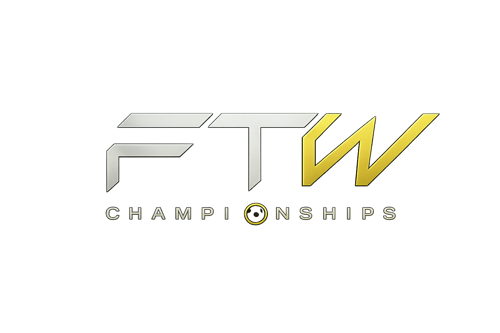

<div align="center">
  

  # FTW Championships

  ### Play. Compete. Dominate.

  [](https://nextjs.org/)
  [](https://www.typescriptlang.org/)
  [](https://tailwindcss.com/)
  [](https://github.com/omprabhat21/ftw-championships)

  <p align="center">
    <strong>FTW Championships</strong> is India's premier FC Mobile tournament platform, delivering a world-class competitive experience with premium modern design, interactive live countdowns, real-time news updates, and custom player/team registrations.
  </p>

  ---
  
  [Explore Platform](#-key-features) • [Tech Stack](#%EF%B8%8F-tech-stack) • [Getting Started](#-getting-started) • [Project Structure](#-project-structure)
</div>

<br />

## 🌟 Key Features

- 🏎️ **Turbopack Powered**: Blazing-fast hot-reloading and development builds.
- ⏳ **Live Countdown**: Keep track of the days, hours, and minutes leading to Season VII kickoff.
- 🏆 **Hall of Fame & Stats**: Dedicated pages displaying champions, team rosters, and historical stats.
- 🎨 **Premium UI/UX**: Immersive dark mode, gold-accented styling, glassmorphic card layouts, and smooth animations using **Framer Motion**.
- 📋 **Seamless Registrations**: Custom registration flow for new teams and players.
- 📱 **Fully Responsive**: Optimized for everything from mobile devices to large desktop monitors.

---

## 🛠️ Tech Stack

- **Core Framework:** Next.js 16 (App Router)
- **UI Library:** React 19
- **Bundler/Compiler:** Turbopack (`next dev --turbo`)
- **Styling:** Tailwind CSS v4
- **Animations:** Framer Motion
- **Icons:** React Icons, Lucide React

---

## 🚀 Getting Started

To run the project locally on your machine:

### 1. Clone the repository
```bash
git clone https://github.com/mohitraj8503/ftw-championships.git
cd ftw-championships
```

### 2. Install Dependencies
```bash
npm install
```

### 3. Run the Development Server (with Turbopack)
```bash
npm run dev
```

Open [http://localhost:3000](http://localhost:3000) (or the assigned port) in your browser to view the app.

### 4. Build for Production
```bash
npm run build
npm start
```

---

## 📁 Project Structure

```
ftw-championships/
├── app/                  # Next.js App Router (pages and layouts)
│   ├── about/            # About page
│   ├── contact/          # Contact details page
│   ├── faq/              # FAQs page
│   ├── meet-the-team/    # Meet the team page
│   └── page.tsx          # Homepage
├── components/           # Reusable UI React components
│   ├── common/           # Shared page layouts, page heroes
│   ├── menu/             # Navigation menu components
│   └── hero.tsx          # Homepage Hero section
├── public/               # Static assets (images, logos, SVGs)
│   ├── images/           # Global images & Hero banners
│   └── team/             # Team member photos
└── package.json          # Project dependencies & scripts
```

---

<div align="center">
  <p>Created with ❤️ by the FTW Championships Team</p>
</div>
